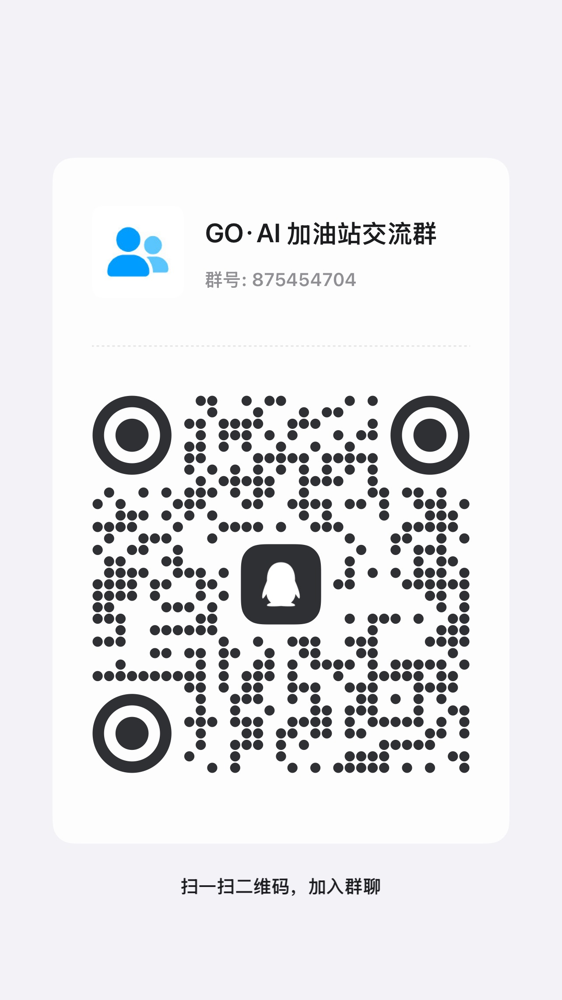

# 💬 联系我们

如果您在使用 **GasOrange** 平台的过程中遇到任何技术问题，或有商业合作、大额充值、定制开发等需求，欢迎通过以下方式与我们取得联系。我们的客服与技术支持团队将竭诚为您服务。

## 官方联系通道

  <!-- 微信群 -->
  

    
💬

    
微信联系

    
扫码加入交流群

    

      
    

    

      若二维码失效，可添加微信：<strong style="color: var(--vp-c-brand-1);">gasorange</strong>
    

  

  <!-- QQ群 -->
  

    
🐧

    
QQ 联系

    
扫码加入 QQ 群

    

      
    

    

      QQ号 / 群号：<strong style="color: var(--vp-c-brand-1);">1214336214</strong>
    

  

  <!-- Telegram群组 -->
  

    
✈️

    
Telegram 联系

    
加入 Telegram 交流群

    

      <a href="https://t.me/+9U9iHEyJwtkwY2M9" target="_blank" rel="noopener noreferrer" style="text-decoration: none; display: flex; flex-direction: column; align-items: center; gap: 8px;">
        📢
        点击加入群组
      </a>
    

    

      群组链接：<a href="https://t.me/+9U9iHEyJwtkwY2M9" target="_blank" rel="noopener noreferrer" style="color: var(--vp-c-brand-1); text-decoration: none; font-weight: 600;">点击跳转群组</a>
    

  

::: tip 温馨提示
* 添加微信、QQ 或 Telegram 时，请备注 **“GasOrange 咨询”** 或您的 **平台账号/ID**，以便我们快速为您处理。
* 技术支持服务时间：周一至周五 09:30 - 19:00。非工作时间如有紧急问题，亦可留言，我们会在看到消息的第一时间回复。
:::
